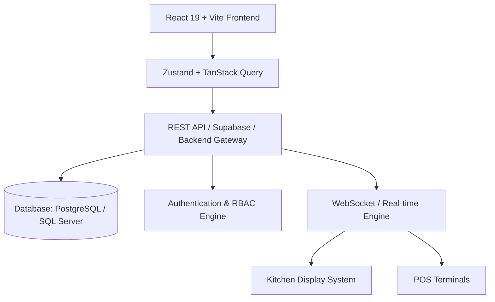

# CafePilote - Project Setup & Architecture

## 1. System Overview
**CafePilote** is a modern, high-performance, enterprise-grade Point of Sale (POS) and Enterprise Resource Planning (ERP) platform designed specifically for cafes, restaurants, and QSR (Quick Service Restaurant) chains.



## 2. Technology Stack
- **Core Framework**: React 19, TypeScript, Vite
- **UI & Styling**: TailwindCSS, shadcn/ui, Lucide Icons, Framer Motion
- **State Management**: Zustand (Global UI & Offline Cart State), TanStack Query v5 (Server State)
- **Routing & Forms**: React Router v6, React Hook Form, Zod Validation
- **Utilities**: Axios, date-fns, xlsx, jspdf / html2canvas (Receipt & Report generation)

## 3. Directory Layout Guidelines
```
src/
├── assets/          # Static assets (images, logos, icons)
├── components/      # Shared UI components (shadcn/ui primitives)
├── context/         # React contexts (Theme, Auth)
├── hooks/           # Custom reusable hooks
├── lib/             # Utility functions, axios instances, helpers
├── modules/         # Feature-based modular architecture
│   ├── pos/         # Billing, Cart, Hold/Resume, Split Bill
│   ├── kitchen/     # KDS Order Tickets & Status Updates
│   ├── inventory/   # Stock ledger, Recipes, Deduction
│   ├── purchases/   # POs, Suppliers, GRN
│   ├── crm/         # Customers, Loyalty Engine
│   ├── franchise/   # Outlets, Franchises, Multi-tenant
│   └── reports/     # Analytics, Exports, Charts
├── services/        # API calls & data fetching logic
├── store/           # Zustand state stores
└── types/           # TypeScript interfaces & type definitions
```

## 4. Environment Configuration
Create a `.env` file in the root directory:
```ini
VITE_APP_TITLE=CafePilote POS
VITE_API_BASE_URL=http://localhost:5000/api/v1
VITE_ENABLE_REALTIME=true
VITE_DEFAULT_CURRENCY=INR
VITE_TAX_MODE=GST
```
