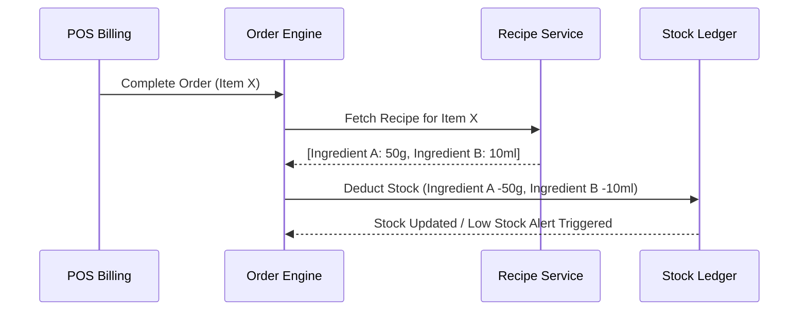

# Inventory & Recipe Management Module

## 1. Overview
Tracks raw ingredients, finished products, stock movements, and automatic stock deduction based on recipe mappings upon order completion.



## 2. Stock Ledger & Movement Types
- **INWARD**: Goods received via Purchase Order (GRN).
- **OUTWARD**: Automatic consumption via POS sales.
- **WASTAGE**: Manual adjustment for expired or damaged items.
- **TRANSFER**: Stock movement between central warehouse and outlet kitchens.

## 3. Key TypeScript Schemas
```typescript
export interface Ingredient {
  id: string;
  name: string;
  unit: 'KG' | 'GRAM' | 'LITER' | 'ML' | 'PIECE';
  currentStock: number;
  minStockLevel: number;
  costPerUnit: number;
}

export interface Recipe {
  productId: string;
  ingredients: Array<{
    ingredientId: string;
    quantityRequired: number;
  }>;
}
```
