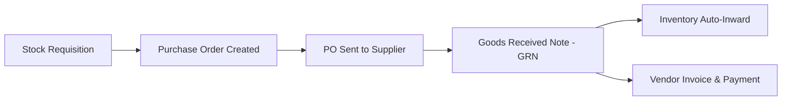

# Purchase & Vendor Management Module

## 1. Procurement Workflow

## 2. Key Features
- **Vendor Directory**: Manage supplier contact information, GST numbers, payment terms, and lead times.
- **Purchase Order (PO)**: Generate POs with auto-calculated total costs, tax rates, and delivery dates.
- **GRN Processing**: Match received items against PO quantities; log partial deliveries and damaged goods.
- **Accounts Payable**: Track unpaid supplier invoices and record payment receipts.
