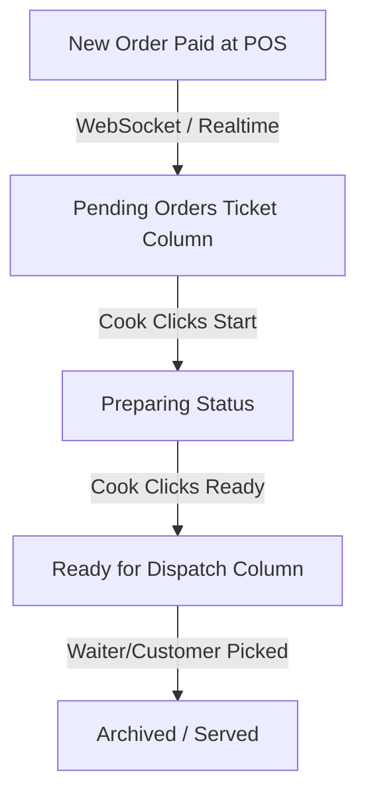

# Kitchen Display System (KDS) Module

## 1. Overview
The KDS module provides real-time order visibility to kitchen staff on touch-screen tablets or monitors, eliminating paper kitchen order tickets (KOTs).

## 2. Core Functional Requirements
- **Real-time Synchronization**: Instant push notifications for incoming orders via WebSockets.
- **Station-based Filtering**: Route drinks to Bar KDS, food items to Main Kitchen KDS, desserts to Bakery KDS.
- **Visual Timers**: Color-coded ticket headers (Green: < 5 mins, Yellow: 5-15 mins, Red: > 15 mins overdue).
- **Audio Alerts**: Configurable chime sound when a new order arrives or order modification is sent.
