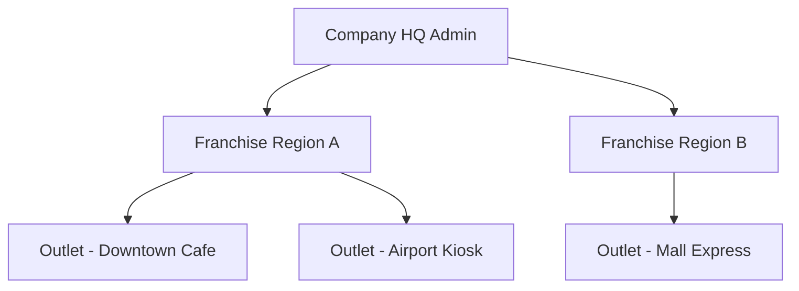

# Multi-Outlet & Franchise Management Module

## 1. Hierarchy & Multi-Tenancy

## 2. Features
- **Centralized Menu Management**: Push global menu items and prices while allowing outlets local pricing overrides.
- **Royalty Engine**: Track net revenue per franchise outlet and compute fixed % royalty fees.
- **Central Supply Chain**: Outlets issue stock requests to HQ central warehouse.
- **Cross-Outlet Analytics**: Compare performance across outlets, regions, and store types.
