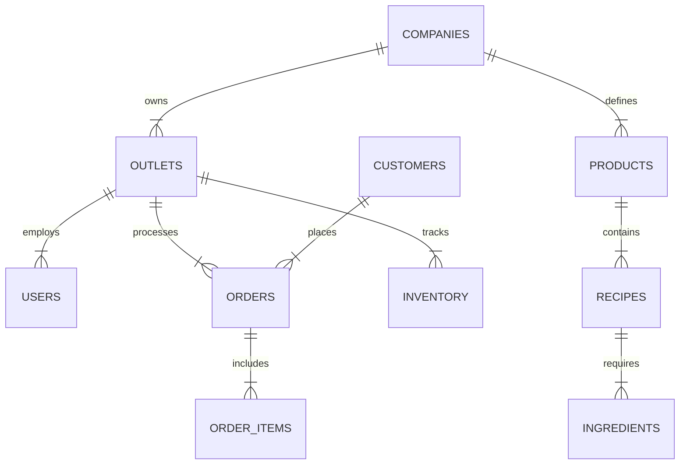

# Database Architecture & Schema

## 1. Entity-Relationship Diagram (ERD)


## 2. Complete SQL Schema (PostgreSQL / T-SQL compatible DDL)

```sql
-- Companies (Tenants)
CREATE TABLE Companies (
    Id UNIQUEIDENTIFIER PRIMARY KEY DEFAULT NEWID(),
    Name NVARCHAR(100) NOT NULL,
    GSTIN NVARCHAR(20) NULL,
    CreatedAt DATETIME2 DEFAULT GETUTCDATE()
);

-- Outlets
CREATE TABLE Outlets (
    Id UNIQUEIDENTIFIER PRIMARY KEY DEFAULT NEWID(),
    CompanyId UNIQUEIDENTIFIER NOT NULL FOREIGN KEY REFERENCES Companies(Id),
    Name NVARCHAR(100) NOT NULL,
    Address NVARCHAR(255) NULL,
    Phone NVARCHAR(20) NULL,
    IsActive BIT DEFAULT 1
);

-- Users
CREATE TABLE Users (
    Id UNIQUEIDENTIFIER PRIMARY KEY DEFAULT NEWID(),
    CompanyId UNIQUEIDENTIFIER NOT NULL FOREIGN KEY REFERENCES Companies(Id),
    OutletId UNIQUEIDENTIFIER NULL FOREIGN KEY REFERENCES Outlets(Id),
    FullName NVARCHAR(100) NOT NULL,
    Email NVARCHAR(100) NOT NULL UNIQUE,
    PasswordHash NVARCHAR(255) NOT NULL,
    Role NVARCHAR(20) NOT NULL, -- SUPER_ADMIN, MANAGER, CASHIER, KITCHEN
    IsActive BIT DEFAULT 1
);

-- Products & Categories
CREATE TABLE Categories (
    Id UNIQUEIDENTIFIER PRIMARY KEY DEFAULT NEWID(),
    CompanyId UNIQUEIDENTIFIER NOT NULL FOREIGN KEY REFERENCES Companies(Id),
    Name NVARCHAR(50) NOT NULL
);

CREATE TABLE Products (
    Id UNIQUEIDENTIFIER PRIMARY KEY DEFAULT NEWID(),
    CompanyId UNIQUEIDENTIFIER NOT NULL FOREIGN KEY REFERENCES Companies(Id),
    CategoryId UNIQUEIDENTIFIER NOT NULL FOREIGN KEY REFERENCES Categories(Id),
    Name NVARCHAR(100) NOT NULL,
    SKU NVARCHAR(50) NULL,
    Price DECIMAL(18,2) NOT NULL,
    TaxRate DECIMAL(5,2) DEFAULT 0.00,
    IsActive BIT DEFAULT 1
);

-- Orders
CREATE TABLE Orders (
    Id UNIQUEIDENTIFIER PRIMARY KEY DEFAULT NEWID(),
    OutletId UNIQUEIDENTIFIER NOT NULL FOREIGN KEY REFERENCES Outlets(Id),
    UserId UNIQUEIDENTIFIER NOT NULL FOREIGN KEY REFERENCES Users(Id),
    OrderNumber NVARCHAR(50) NOT NULL,
    OrderType NVARCHAR(20) NOT NULL, -- DINE_IN, TAKEAWAY, DELIVERY
    Status NVARCHAR(20) NOT NULL, -- DRAFT, PAID, CANCELLED
    Subtotal DECIMAL(18,2) NOT NULL,
    TaxTotal DECIMAL(18,2) NOT NULL,
    DiscountTotal DECIMAL(18,2) NOT NULL,
    GrandTotal DECIMAL(18,2) NOT NULL,
    CreatedAt DATETIME2 DEFAULT GETUTCDATE()
);

-- Order Items
CREATE TABLE OrderItems (
    Id UNIQUEIDENTIFIER PRIMARY KEY DEFAULT NEWID(),
    OrderId UNIQUEIDENTIFIER NOT NULL FOREIGN KEY REFERENCES Orders(Id),
    ProductId UNIQUEIDENTIFIER NOT NULL FOREIGN KEY REFERENCES Products(Id),
    Quantity INT NOT NULL,
    UnitPrice DECIMAL(18,2) NOT NULL,
    TotalPrice DECIMAL(18,2) NOT NULL,
    Notes NVARCHAR(255) NULL
);
```
