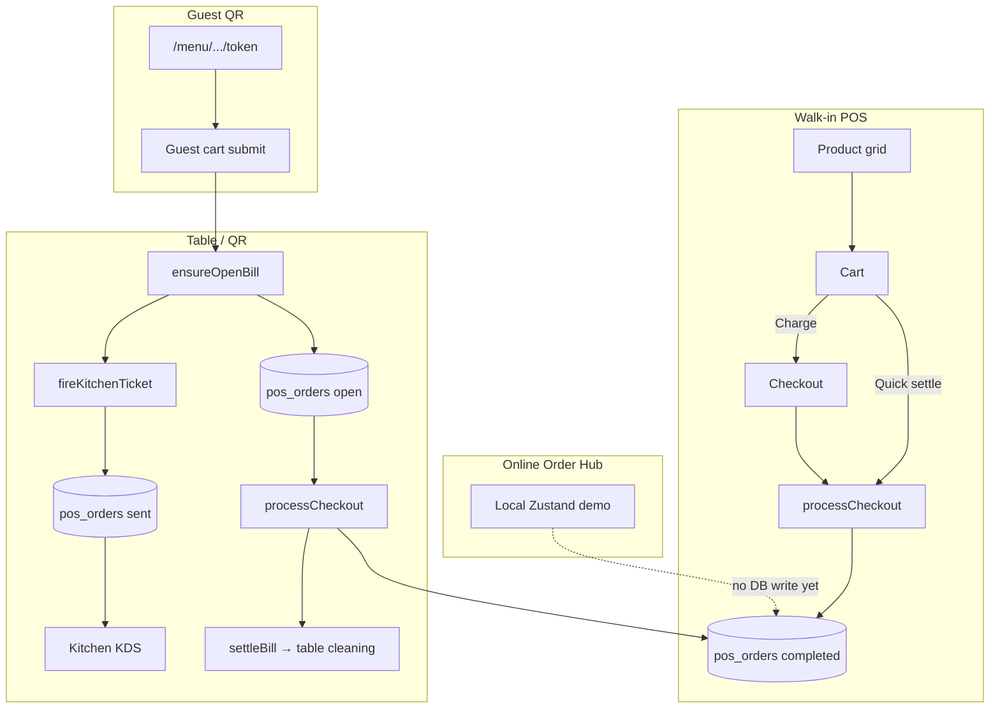

# CafePilots — Transaction Flows

Complete guide to how money and orders move through CafePilots POS / ERP.

**Last updated:** 2026-07-21  
**Scope:** Counter POS, table billing, held orders, payments, QR guest ordering, kitchen (KDS), Online Order Hub, refunds, inventory, reports.

---

## Status legend

| Status | Meaning |
|--------|---------|
| **Production** | Live path used in ops; writes to Supabase |
| **Partial** | UI works; persistence incomplete |
| **Demo / stub** | Local or placeholder only |

---

## 1. Shared data model

### Primary tables

| Table | Role |
|-------|------|
| `pos_orders` | Sales, open checks, kitchen tickets, held orders |
| `pos_order_items` | Line items |
| `dining_tables` | Table status + QR tokens |
| `customers` | Optional CRM at checkout |
| `inventory` / `daily_stock` / `sale_items` | Legacy Sales Entry only — **not** POS checkout |

### `pos_orders.status`

| Status | Meaning |
|--------|---------|
| `open` | Unpaid table check (hidden from KDS) |
| `sent` | Kitchen ticket (shown on KDS) |
| `held` | Parked counter order |
| `completed` | Paid sale |

### `kitchen_status`

`pending` → `preparing` → `ready` → `delivered`

### Schema scripts

- `01_pos_orders.sql` — base tables  
- `02_kds_updates.sql` — kitchen status  
- `scripts/table_billing_schema.sql` — table billing columns  
- `03_fix_pos_rls.sql` — RLS (often disabled for MVP)

### External services

- **Supabase** — DB + KDS realtime  
- **Paytm / PhonePe / Amazon Pay** — `server/paymentGateways.js`, `api/payment-gateways/*`  
- **No Razorpay** in codebase today

---

## 2. End-to-end map



---

## 3. Counter POS (walk-in billing)

**Status:** Production  

**Entry**

- `/erp/pos` → `POSDashboard`  
- `/erp/pos/checkout` → `CheckoutPage`

**Key files**

- `src/modules/pos/pages/POSDashboard.tsx`
- `src/modules/pos/components/ProductGrid.tsx`
- `src/modules/pos/components/Cart.tsx`
- `src/modules/pos/pages/CheckoutPage.tsx`
- `src/modules/pos/store/usePOSStore.ts` (`addItem`, `processCheckout`)
- `src/modules/pos/components/ThermalReceipt.tsx`

### Flow

```
Add items → Cart → Charge / Quick settle → Payment → pos_orders (completed)
```

1. Staff adds products → `usePOSStore.addItem`
2. Optional discount, notes, customer on cart
3. **Full checkout:** navigate to `/erp/pos/checkout` → choose method → `handleCompleteOrder` → `processCheckout`
4. **Quick settle:** set method + tender on cart → `processCheckout` → success via `?settled=quick`
5. Tax applied (default 18%), insert:
   - `pos_orders` — `status: completed`, `order_source: 'pos'`
   - `pos_order_items` — line items
6. Cart cleared; `lastOrder` set; event `cafepilots:orders-updated`
7. Success UI → print / WhatsApp receipt (optional)

**Tables:** `pos_orders`, `pos_order_items` (+ optional `customers`)  
**Note:** Counter completed orders get `kitchen_status: pending` and can appear on KDS.

---

## 4. Table billing (open → kitchen → settle)

**Status:** Production  

**Entry**

- `/erp/tables` → open table → POS  
- Or attach table from POS  
- Pay via Cart Charge / Quick settle / Tables “Pay Bill”

**Key files**

- `src/modules/tables/pages/TablesDashboard.tsx`
- `src/modules/tables/components/TableActionPanel.tsx`
- `src/modules/tables/store/useTableBillStore.ts`
- `src/modules/tables/store/useTableStore.ts`
- `src/modules/pos/store/usePOSStore.ts` (`loadTableBill`, `fireActiveTableKitchen`, `processCheckout` → `settleBill`)

### Flow

```
Seat table → Open bill → Add items → Send to kitchen → Guest eats → Pay → Settle
```

1. `ensureOpenBill` → local bill (`cafepilots-table-bills`) + table status `occupied`
2. Cart edits → `syncBillFromCart` → cloud open order (`status: open`, `payment_method: pending`)
3. **Fire kitchen:** `fireKitchenTicket` → new `pos_orders` row `status: sent`, `kitchen_status: pending`
4. **Settle:** checkout inserts paid `completed` order → `settleBill`:
   - fires any remaining unfired items
   - marks local bill paid
   - closes cloud open check
   - table → `cleaning`

**Tables:** `pos_orders` (`open` / `sent` / `completed`), `pos_order_items`, `dining_tables`

---

## 5. Held orders / resume

**Status:** Production (counter holds)  

**Entry**

- Cart **Hold** / Checkout **Hold Bill**
- POS `?view=held` → `POSHeldOrders`

**Key files**

- `src/modules/pos/store/usePOSStore.ts` — `holdCurrentOrder`, `resumeOrder`, `discardHeldOrder`, `mergeHeldOrders`, `transferHeldTable`
- `src/modules/pos/components/POSHeldOrders.tsx`

### Flow

| Action | Behavior |
|--------|----------|
| Hold (counter) | Insert `pos_orders` `status: held` + items; clear cart |
| Park (table) | Sync open bill + clear cart — **not** a held row |
| Resume | Load items into cart; **delete** held row |
| Merge held | Rewrite target items; delete source |
| Transfer held | Updates notes / table label only — does not open a real table bill |

---

## 6. Split payment & table move / merge

### Split payment — Partial

**Entry:** Cart Split → `/erp/pos/checkout?split=1`, or Split method on checkout  

**Flow:** Staff enters split lines → sum must cover total → `processCheckout` with `payment_method: 'split'`  

**Gap:** No per-method tender rows stored — only a single `split` method on the order.

### Table move / merge — Production

**Entry:** Tables board (Move / Merge), Cart Transfer → `/erp/tables`  

**Files:** `useTableBillStore.movePartyToTable`, `useTableStore.mergeTables`  

**Flow:** Move open bill to another table; merge routes bill to primary table id.

---

## 7. Payment methods

| Method | Real money movement | Persisted as |
|--------|---------------------|--------------|
| Cash | Manual tender / change | `payment_method`, `tendered_amount`, `change_due` |
| Card | Manual (terminal outside app) | `card` |
| UPI | Manual “Mark received” | `upi` |
| Wallet / gift / store credit | Prompt only — no ledger | method string |
| Split | Multi-line UI | single `split` |
| Paytm / PhonePe / Amazon Pay | Live gateway when configured | method + provider IDs in notes |

### Gateway flow (Paytm / PhonePe / Amazon Pay)

**Status:** Production-capable when outlet gateways are configured  

**Files**

- Client: `src/modules/pos/services/paymentGatewayService.ts`
- Server: `server/paymentGateways.js`, `api/payment-gateways/{create,status,settings,callback}.js`
- Settings UI: `src/modules/settings/components/PaymentGatewaySettings.tsx`

```
Select gateway → createGatewayPayment → customer pays
  → checkGatewayPaymentStatus → success
  → processCheckout(paymentReference)
```

**Configure in:** ERP → Settings → Payment gateways (per outlet).

---

## 8. QR menu / guest ordering

**Status:** Production (order-to-kitchen; pay at counter)  

**Entry**

- `/menu/t/:qrToken` or `/menu/:outletId/:qrToken`
- Table QR print from Tables board

**Key files**

- `src/modules/tables/lib/resolveTableByQr.ts`
- `src/modules/customer/store/useCustomerOrderStore.ts`
- `src/modules/customer/pages/CustomerCartModal.tsx`
- `src/modules/customer/pages/GuestOrderStatus.tsx`

### Flow

```
Scan QR → Browse menu → Submit → Open table bill + kitchen ticket → Staff settles on POS
```

1. Resolve table by `dining_tables.qr_code_token`
2. Guest adds items → submit → `addItemsToTable(..., 'qr', { fireKitchen: true })`
3. Upserts open check `order_source: 'qr'` + kitchen `sent` ticket
4. Guest tracks kitchen status  
5. **No guest payment** — staff collects on POS

---

## 9. Kitchen tickets & KDS

**Status:** Production  

**Entry:** `/erp/kitchen` → `KitchenDisplay`

**Key files**

- `useTableBillStore.insertKitchenTicket` / `fireKitchenTicket`
- `src/modules/kitchen/store/useKitchenStore.ts`
- `src/modules/kitchen/` display pages

### How tickets are created

| Trigger | Result |
|---------|--------|
| POS cart **Send** (table bill) | `sent` ticket |
| QR guest submit | `sent` ticket |
| Settle with unfired items | Auto-fire then pay |
| Counter checkout complete | `completed` row with `kitchen_status: pending` (can show on KDS) |

### KDS flow

```
pending → preparing → ready → delivered
```

- Fetches `pos_orders` where kitchen status ≠ `delivered` and status ∉ `{open, held}`
- Realtime channel: `kds_orders_channel`

---

## 10. Online Order Hub (Swiggy / Zomato / ONDC / etc.)

**Status:** Demo / stub  

**Entry**

- `/erp/online-orders`
- POS → Online tab / sticky Online Orders bar

**Key files**

- `src/modules/pos/onlineOrders/store.ts`
- `src/modules/pos/onlineOrders/seed.ts`
- `src/modules/pos/pages/OnlineOrdersPage.tsx`
- Components under `src/modules/pos/onlineOrders/components/`

### Current flow (not live marketplaces)

```
Seed / Demo simulator → Local Zustand order
  → Accept / Reject / Status updates (memory only)
  → Toast + Alert Center
```

| Step | What happens today |
|------|--------------------|
| Incoming order | Seed data or `createDemoIncomingOrder()` |
| Accept | Local status → preparing; alert says “kitchen ticket” — **no** `pos_orders` insert |
| Reject / expire | Local status only |
| Payment badges | Display only (`prepaid` / `cod` / `online` / `card`) |
| Metrics / refunds | In-memory |

### What to configure later for real orders

1. Aggregator or direct APIs (UrbanPiper / Petpooja / Swiggy / Zomato / ONDC)  
2. Outlet credentials + webhook URL  
3. Backend webhook → `online_orders` / `pos_orders`  
4. Realtime subscribe → POS toast  
5. Accept → real kitchen ticket + optional print  

**Nothing to paste for Swiggy/Zomato today** — Integrations settings page not built yet.

---

## 11. Refunds / voids

**Status:** Mostly stub  

| Action | Behavior | Status |
|--------|----------|--------|
| Checkout **Void Bill** | Notice only (“manager approval”) | Stub |
| History filters cancelled / refunded | Query filters only | No write path |
| History **Reorder** | Re-adds lines to cart | Works |
| Discard open table bill | Deletes cloud open check | Ops cancel, not refund |
| Discard held | Deletes held row | Works |
| Online hub `refunded` | Demo status | Demo |

There is **no** POS action that marks a completed sale as refunded or reverses tender.

---

## 12. Inventory on sale

**Status:** Not wired to POS  

| Path | Deducts stock? |
|------|----------------|
| `processCheckout` | No |
| Table / QR / kitchen | No |
| Online hub accept | No |
| Legacy `SalesEntry` (`/sales/entry` → redirects to POS) | Yes (recipes → inventory) |
| Product grid OOS | Display only |

POS records sales **without** consuming inventory / recipe BOM.

---

## 13. Reports & sales recording

**Status:** Production  

**Write:** Every paid checkout → `pos_orders` + `pos_order_items` (`status: completed`)

**Read**

- `src/modules/reports/store/useReportStore.ts` — `status = completed`
- `src/modules/pos/components/POSOrderHistory.tsx`
- Event `cafepilots:orders-updated` after checkout

Open / sent / held rows are **excluded** from sales revenue reports by design.

---

## 14. Quick reference — who gets paid when

| Channel | Order created | Kitchen | Customer pays | Staff settles |
|---------|---------------|---------|---------------|---------------|
| Counter POS | On checkout | Optional (pending on complete) | At counter | Same step |
| Table dine-in | Open check early | On Send | At counter / table | Checkout |
| QR guest | On submit | Immediate | Later | Staff on POS |
| Online Hub | Demo local only | Simulated alert | N/A (demo) | N/A |

---

## 15. File index (core)

| Area | Path |
|------|------|
| POS store | `src/modules/pos/store/usePOSStore.ts` |
| Checkout | `src/modules/pos/pages/CheckoutPage.tsx` |
| Cart | `src/modules/pos/components/Cart.tsx` |
| Table bills | `src/modules/tables/store/useTableBillStore.ts` |
| Tables UI | `src/modules/tables/pages/TablesDashboard.tsx` |
| Kitchen | `src/modules/kitchen/` |
| QR guest | `src/modules/customer/` |
| Online hub | `src/modules/pos/onlineOrders/` |
| Gateways (client) | `src/modules/pos/services/paymentGatewayService.ts` |
| Gateways (server) | `server/paymentGateways.js`, `api/payment-gateways/` |
| Reports | `src/modules/reports/` |
| Schema | `scripts/table_billing_schema.sql`, `01_pos_orders.sql`, `02_kds_updates.sql` |

---

## 16. Known gaps (roadmap)

1. **Online Order Hub** → real aggregator webhooks + DB  
2. **Refunds / voids** → manager-approved write path  
3. **Inventory** → deduct on `processCheckout` / recipe fire  
4. **Split tender** → persist multiple payment lines  
5. **Wallet / gift / credit** → balance ledger  
6. **Guest QR payment** → optional pay-before-fire  
7. **Razorpay** (or other) if required by market  

---

*Generated from the CafePilots codebase. Update this file when transaction paths change.*
