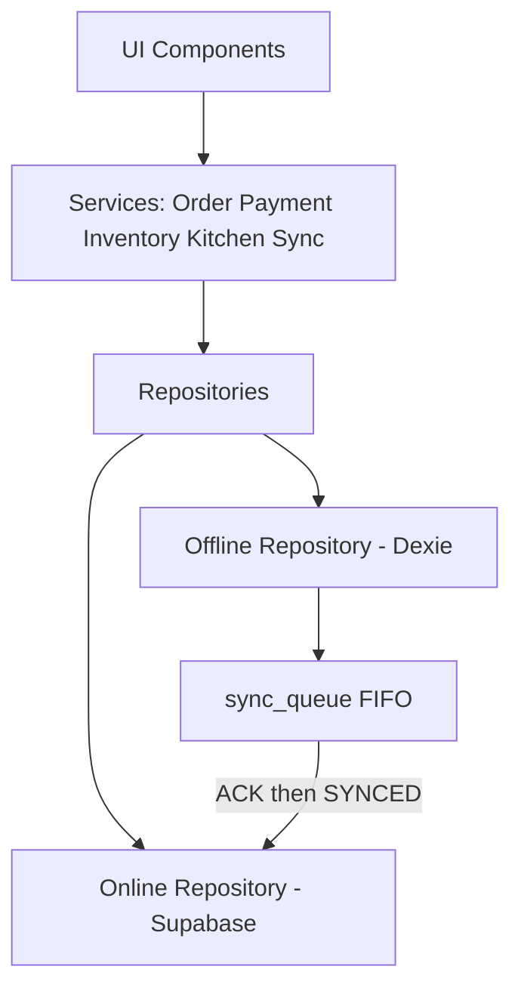
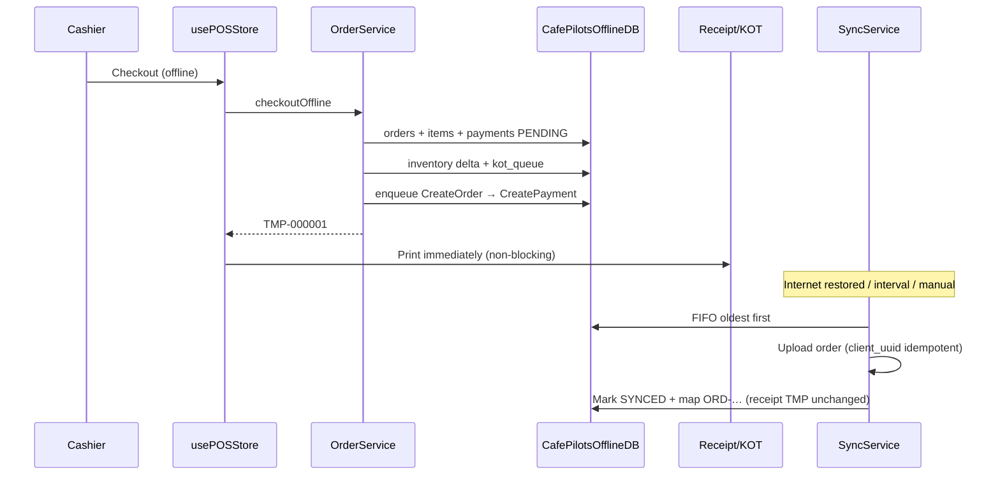

# CafePilots Enterprise Offline POS Architecture

## Guarantee

**Restaurant orders are never lost.** Local IndexedDB (`CafePilotsOfflineDB` via Dexie) is the durable source of truth while offline. Server ACK is required before `SYNCED`. Pending rows are never deleted.

## Plan matrix

| Plan | Capability |
|------|------------|
| Lite | Online only |
| Standard | Online only |
| Professional | Offline billing |
| Enterprise | Full offline (billing + kitchen + inventory cache + Sync Center) |

Runtime kill-switch: feature flag `offline.billing` (default on; plan gate still applies).

## Layering (no duplicated business logic)



## Offline checkout path



## Folder structure

```
src/modules/offline/
  db/CafePilotsOfflineDB.ts
  types/entities.ts
  lib/{ids,capabilities}.ts
  security/localEncryption.ts
  repositories/{Offline*,Online*,SyncQueue,AuditLog}*
  services/{Order,Payment,Inventory,Kitchen,Sync,Connectivity,Conflict,Cache}*
  pages/SyncCenterPage.tsx
  sql/offline_idempotency_schema.sql
  __tests__/
  bootstrap.ts
  index.ts
  ARCHITECTURE.md
```

## Sync status

`PENDING | SYNCING | SYNCED | FAILED | CONFLICT`

## Job retry backoff

10s → 30s → 1m → 5m → 15m → 1h

## Data safety rules

1. Never delete local order until server ACK
2. Keep local history after sync (mapping only)
3. Printed `TMP-*` numbers never change
4. Dependent jobs wait (Order before Payment)
5. No localStorage for transactional data
6. No passwords / tokens / card PAN in IndexedDB
